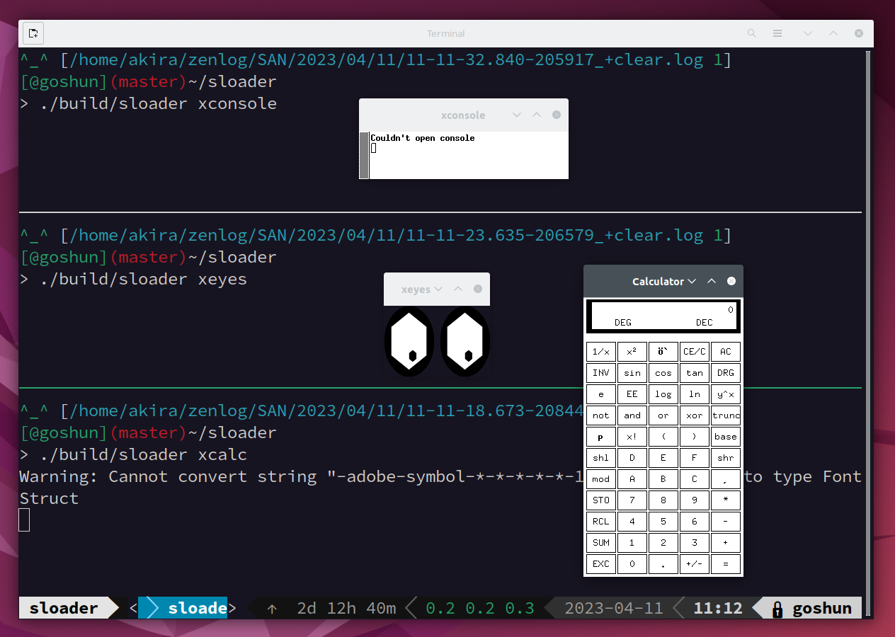

# sloader <!-- omit in toc -->
`sloader` is an ELF loader that aims to replace `ld-linux.so.2` of glibc. 

## Table of Contents <!-- omit in toc -->
- [Current status](#current-status)
- [How to build and use](#how-to-build-and-use)
- [Why I am making alternative loader](#why-i-am-making-alternative-loader)
  - [What is a loader](#what-is-a-loader)
  - [Problem of `ld-linux.so`](#problem-of-ld-linuxso)
  - [Motivation of making sloader](#motivation-of-making-sloader)
  - [Developement principles of sloader](#developement-principles-of-sloader)
- [For developpers](#for-developpers)
  - [How to build and run tests](#how-to-build-and-run-tests)
  - [Test using custom build glibc](#test-using-custom-build-glibc)

## Current status
`sloader` can load many practical programs such as `cmake`, `g++`, `ld`, `htop`, etc. Furthermore, `sloader` can launche some GUI applications.


However, `sloader` depends on `ld-linux.so` because I cannot statically link `sloader` now. 

## How to build and use
```
$ git clone https://github.com/akawashiro/sloader.git
$ cd sloader
$ mkdir build
$ cmake -S . -B build -G Ninja
$ cmake --build build
$ ./build/sloader ls
```

## Why I am making alternative loader
### What is a loader
When you run an executable binary file on Linux using execve(2), there are two execution paths.
- Linux kernel loads the file to the memory space.
- The loader specified by the file loads the file to the memory space.

You can check the specified loader path using `readelf -l`. In most cases,  you will find `Requesting program interpreter: /lib64/ld-linux-x86-64.so.2` which means the loader loads the binary. Although the path includes `-x86-64` because my machine is x86-64, I call it `ld-linux.so` from now for generality.

```
$ readelf -l $(which nvim) | grep INTERP -A 2
  INTERP         0x0000000000000318 0x0000000000000318 0x0000000000000318
                 0x000000000000001c 0x000000000000001c  R      0x1
      [Requesting program interpreter: /lib64/ld-linux-x86-64.so.2]
```

`ld-linux.so` does three things when loading binary files.
- Seaches shared libraries that the file needs.
- Loads all shared libraries and the file to the memory.
- Resolves symbols of shared libraries and the file.

It is important to understand precisely how `ld-linux.so` works. For example, valuable hacks with environment variables such as LD_PRELOAD and LD_AUDIT are implemented by changing their behavior. Understanding the behavior of `ld-linux.so` will allow you to infer what these environment variables can and cannot do. Also, understanding it is essential for creating software like [https://github.com/akawashiro/sold](https://github.com/akawashiro/sold) that forcibly links shared libraries.

### Problem of `ld-linux.so`
`ld-linux.so` is installed on Linux as part of GNU libc, and its complete source code is publicly available. However, two problems exist in understanding the behavior of `ld-linux.so` from the published source code.

The first problem is that the GNU libc source code is hard to read. GNU libc is a software with a long history written in C language. It also requires portability to multiple architectures such as x86-84, Alpha, ARM, and PowerPC. As a result, macros are used extensively throughout the source code, making it difficult to follow the flow of the program.

The second problem is that `libc.so` is simultaneously initialized when `ld-linux.so` loads an executable file. And it is hard to understand the initialization and the loading process separately. libc.so is the so-called standard C library, which is almost certainly loaded when the binary file is loaded by `ld-linux.so`. `libc.so` and `ld-linux.so` are in the same package, and glibc doesn't explicitly document the relationship between the two components.

### Motivation of making sloader
To solve the above problems and understand `ld-linux.so` behavior, I decided to develop a new loader that can replace `ld-linux.so` . In other words, I am trying to load all the programs that start on Linux (`systemd`, `cat`, `find`, `firefox`, etc.). 

### Developement principles of sloader
I decided the following two principles when I started the development.

The first principle is to use modern C++ instead of C. I try to use modern C++ features up to C++20 to improve readability. I considered using Rust, but I decided that a language compatible with the C language would be better because I would be developing while referring to the GNU libc source code.

The second principle is not to initialize `libc.so`. The purpose is to understand only the load part, so I will not do the complicated `libc.so`.

## For developpers
### How to build and run tests
```
$ git clone https://github.com/akawashiro/sloader.git
$ cd sloader
$ mkdir build
$ cmake -S . -B build -G Ninja
$ cmake --build build
$ cd build
$ ctest -V
```

### Test using custom build glibc
```
$ git clone https://github.com/akawashiro/sloader.git
$ cd sloader
$ mkdir build
$ cmake -S . -B build -G Ninja
$ cmake --build build
$ ./clone_glibc.sh
$ ./build_glibc.sh
$ SLOADER_LIBRARY_PATH=/home/akira/sloader/glibc-install/lib ./build/sloader ./build/tests/hello_glibc/hello_glibc
```
